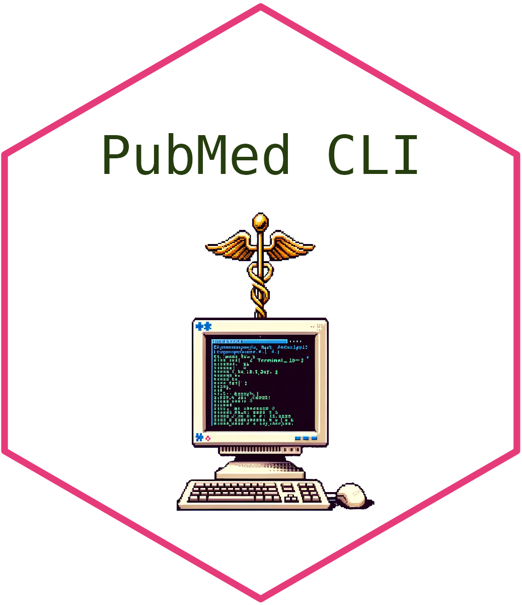

# PubMed command line interface 

## Overview

The PubMed CLI tool is a powerful and efficient command-line interface for searching and retrieving articles from the PubMed database. It allows users to perform targeted searches, fetch article details, and export results in various formats.

## Features

* Search PubMed database using custom queries
* Retrieve article details including title, authors, journal, and abstract
* Export results to CSV format
* Cache search results for improved performance
* Multi-threaded article fetching for faster retrieval
* Interactive mode for browsing search results
* Configurable via YAML file

## Prerequisites

* Python 3.7+
* pip (Python package installer)

## Installation

1. Clone the repository:

   `git clone https://github.com/JonathanEMillar/pubmed_cli.git`
   `cd pubmed_cli  
   `
2. Install the required dependencies:

   `pip install -r requirements.txt  
   `
3. Set up your configuration:

   * Copy `config.yaml`
   * Edit `config.yaml` and add your email and NCBI API key

You can obtain an API key from the [NCBI website](https://ncbiinsights.ncbi.nlm.nih.gov/2017/11/02/new-api-keys-for-the-e-utilities/). 

## Use

### Basic use

To perform a basic search, use the following command:

`python pubmed_search.py -q "your search query" -d 7`

This will search for articles published in the last 7 days matching your query.

### Command-line Options

* `-q, --query`: Specify the search query (required)
* `-d, --days`: Number of days back to search (default: 1)
* `-o, --output`: Enable CSV output of results
* `-c, --clearcache`: Clear the cache before running

### Interactive Mode

After displaying search results, the tool enters an interactive mode where you can:

* View article abstracts
* Open article URLs in your default web browser
* Perform new searches

### Configuration

The `config.yaml` file contains important settings:

yaml

`Email: "your.email@example.com"`
`APIKey: "your_ncbi_api_key"`
`OutputDirectory: "/path/to/output/directory"`
`QueryTerm**: "default search term"`

Ensure you replace the placeholders with your actual information.

### Caching

The tool uses joblib to cache article details, improving performance for repeated searches. The cache is stored in the `artcile cache` directory.

### Logging

Logs are written to `pubmedcli.log` in the same directory as the script.

## Contributing

Contributions are welcome! Please feel free to submit a Pull Request.

## License

This project is licensed under the MIT License - see the [LICENSE](LICENSE) file for details.

## Acknowledgments

* This tool uses the Biopython library for interacting with the NCBI Entrez system
* Thanks to the NCBI for providing the Entrez Programming Utilities

## Support

If you encounter any problems or have any questions, please open an issue on the GitHub repository.
